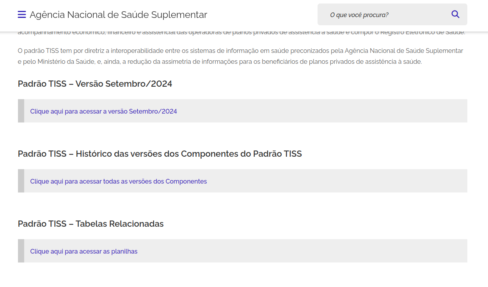
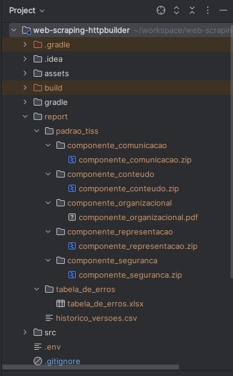
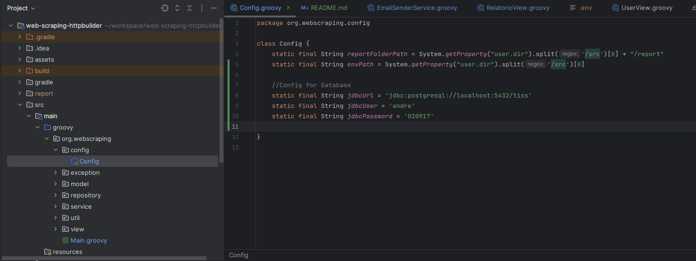
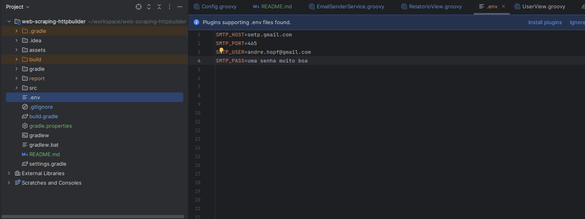
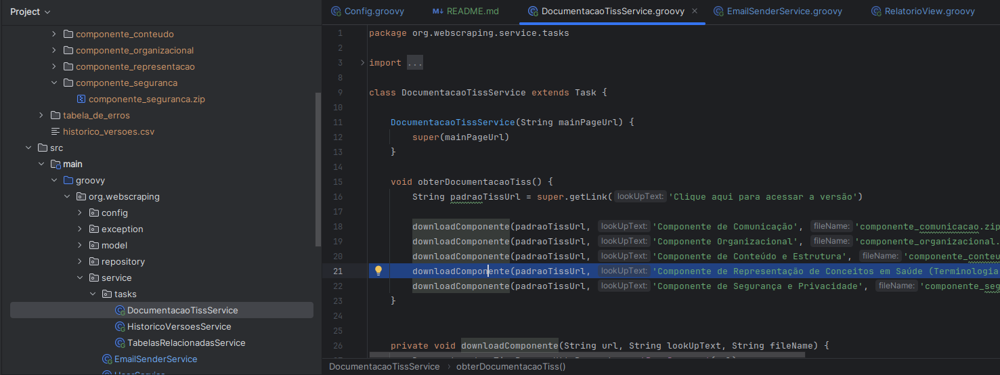

# Web Crawler 

Web Crawler desenvolvido utilizando Groovy com as bibliotecas HTTPbuilder e Jsoup.

## O sistema

O propósito do web crawler é fazer o acesso, download  de arquivos referentes ao [padrão TISS (Troca de Informações na Saúde Suplementar)](https://www.totvs.com/blog/instituicoes-de-saude/tiss/) e o envio de emails contendo estes dados.

O programa faz seu acesso 
inicial na [página da ANS - Agência Nacional de Saúde Complementar](https://www.gov.br/ans/pt-br). 

Então é direcionado à página que contém os documentos referentes ao [padrão de Troca de Informações de Saúde Complementar](https://www.gov.br/ans/pt-br/assuntos/prestadores/padrao-para-troca-de-informacao-de-saude-suplementar-2013-tiss).



O bot acessa a versão mais recente do Padrão TISS, fazendo o download dos arquivos referentes aos cinco componentes: 

* organizacional;
* conteúdo e estrutura;
* representação de conceitos em saúde;
* segurança e privacidade;
* comunicação.

Após o download dos documentos ele acessa o historico de versões, compilando os dados a partir de janeiro de 2016 em um arquivo '.csv'.

Por fim ele faz também o download da Tabela de erros no envio para a ANS.

Os arquivos gerados a partir da execução do sistema são armazenados em um diretório chamado 'report' na raíz do projeto.



## Configurando a aplicação

### Dados de conexão ao banco de dados de usuários

O projeto está configurado para utilizar um banco de dados postgreSQL. 


Para que o sistema possa enviar emails e você possa adicionar novos usuários para que estes recebam os em
Você deverá setar o seu usuario, senha e url para conexão com o banco de dados na classe config.Config




Além disso, neste arquivo você poderá modificar onde você quer que o download dos arquivos seja feito (por padrão o download será realizado na pasta /report na raíz do projeto).

O local do arquivo .env contendo as configurações para o envio de emails também poderá ser feita nessa classe.

### Dados para envio de emails (.env file)

Crie um arquivo .env na raíz do projeto (ou no local que foi setado na classe de configuração citada no tópico anterior) contendo os dados para conexão com seu provedor de emails.

Abaixo dados para conexão com um email da Google:



Obs: se você tiver a autenticação de dois fatores ativada em sua conta Google você deverá fazer o registro de uma senha para utilizar neste aplicativo. Acesse este [link](https://knowledge.workspace.google.com/kb/how-to-create-app-passwords-000009237?hl=pt-br)

Por fim execute o comando 
```bash
gradlew build     #Windows

./gradlew build   #Linux
```


## Executando o Sistema

Inicie o sistema com o comando:

```bash
gradle run
```

Se você configurou o banco de dados, através do menu você poderá gerenciar os usuários e gerar os relatórios e estes serão enviados automaticamente para os usuarios cadastrados no banco de dados.

Se o banco de dados não foi configurado você poderá apenas baixar os arquivos.

ATENÇÃO: por padrão todos os componentes são baixados. O componente de representacao tem aproximadamente 330mb, podendo fazer com que a execução completa do script se torne demorada. Se você quiser optar por não baixar este componente, comente a linha 21 da classe service/tasks/DocumentacaoTissService



Devido ao tamanho dos componentes ser muito elevado, apenas o componente de comunicação é enviado por email.